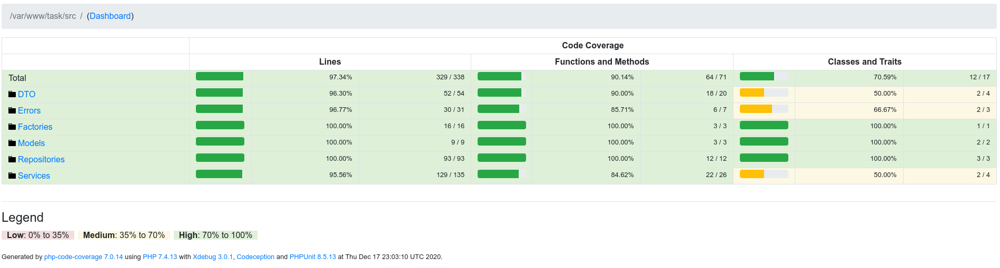

# TASK DEVOPS

TASK API: Simples API using Phalcon Framework

## Motivation

I decided to create a simple API from scratch to demonstrate my way of programming and applying OOP concepts and best practices. As well as DevOps concepts and tests.

### User History

This project is based in this user history:

```
Instructions
- Create a fork from https://github.com/tgsolutionsteam/task
- Pull the repository on your local machine
- Run docker-compose for the provided configuration to have up and working local environment
- Read the task and think about the implementation
- Use any IDE, framework or other tool to accomplish the task
- Once the task is finished or time is up, create a pull request on GitHub to the original repository
- Inform Travian Games HR about the task submission

Task
Create a service to take care of currency exchange rates provided by the https://exchangeratesapi.io/. Store data of currency rates and provide it via XML-RPC and REST API. Notify other services if exchange rates for USD to EUR is changed using Rabbit MQ.

Goals
- Fetch and store currency rates
- Provide XML-RPC & REST API to provide exchange rates from X to Y currency for current day or given date
- REST API and XML-RPC should be protected with Basic auth
- Notify other services via Rabbit MQ that currency rate for USD-to-EUR changed (post a message in to the queue)
- Provide tests for given functionality

Requirements
- Use any framework
- Use docker environment

Web service on http://localhost:8181
Rabbit MQ web interface on http://localhost:15671/ Use guest:guest credentials.
```

Test Guidelines: you can read [here](Tests-Guideline.pdf)

Code Style: you can read [here](CodingSytle-PHP.pdf)

## How To Use

### Start Environment

To use the system, simple Type `make up` to start the container
and `make down` to stop it. In the first run you will need to run `db.migrate` to create the database and `make composer.install` to install all dependencies.

```bash
make up
make db.migrate
make composer.install
make composer.update
make test
make test.unit-coverage
make php.cs
make php.md
make down
```

### How It Works

Every time a REST call is made to the endpoint `/rates` or an XMLRPC call to `/` with the `getRates` method, the API searches the internal cache (Redis) and, if not found anything, searches in the database, if it still does not find values, the API makes a request to the external API and updates the database.

Whenever rates are created or changed, the observer notifies the other services through RabbitMQ.

### Accessing API

After start the conteiner, you can access the API, using any http client,
connect in this address `http://localhost:8181/rates/`. For example using CURL:

```
curl http://localhost:8181/rates/
```

If something wrong occurs, see the Setup Section below, to ensure that all initial steps were made.

To know all endpoint, see OAS bellow.

### Open API Specification

This api use OAS and it spec can be visualized in the openapi.json [here](openapi.json) file and and through the endpoint `/oas`.


## Development


### Cache System

The API uses the self-managing dynamic cache system using Redis. Every time a GET request arrives at the API it checks if there is already a cache for the call and if so, it returns the cache value, if not, it passes the request to the API and at the end of the cycle caches the response. When the API receives action verbs like POST / PUT, the cache system automatically invalidates only the affected endpoints. In this way, the API has a fully automated cache management, significantly reducing the traffic and use of the computational resources of the servers.


### DevOps

The API was conceived within the devops culture using conteinerization. The entire environment is containerized and easily manipulated through a Makefile file.


### Setup project

To set up an API container you should download the source code from
git and install it.

You should only use the `make up` & `make down` to controll your
container.

You are now ready to use the system. Type `make up` to start the container
and `make down` to stop it.

### Build tools

Build the image

```bash
make build
```

### Composer

To install / update or add composer dependencies:

```bash
make composer.install
make composer.update
```

### Code Quality

PHP Metrics:

```bash
make php.metrics
```

PHP CS:

```bash
make php.cs
```

PHP CBF:

```bash
make php.cbf
```

PHP MD:

```bash
make php.md
```

### Tests

Last Coverage:


Run all tests suite

```bash
make test
```

Run specifit test suits

```bash
make test.unit ## unit tests suite
make test.unit-coverage ## coverage
```

### Migrations (DB)

To create DB Structure (Migrations):

```bash
make db.migrate
```

### MakeFile

To make our tools abstract to the intentions we use simple make commands to
perform tasks like: launch a test suite.
Example:.

```bash
make test
```

To learn all the commands the MakeFile can do just use the command
`make` or `make help`


# Importants Notes to Reviewer

1 - Due to only having free nights to work, I tried to do my best in the short time I had, I didn't just want to attend to what was asked for in any way but to implement design standards and good programming practices that I consider important.
1.1 - I just created the XML-RPC for the method getRates, I didn't have much time to make it better.
1.2 - I applied a design pattern called an observer to automate notifications using RabbitMQ, despite implementing a condition to check if the currency is USD to EUR, I believe that a feature demonstrates the use of queues.
1.3 - I did not review the vertical formatting that Robert Martin suggests in the Clean Code with regard to Vertical Continuity and Vertical Distance. Sorry about that.

2 - I changed some files like Dockerfile and docker-compose and installed components to meet some specific needs like tests, for example.

3 - I did not use the mongo present in the docker-compose, but I preferred not to remove it.

4 - I always use automated pipelines when doing Merge Requests, usually using GitLab-CI, but unfortunately there is no time for that either. :)

5 - Maybe you may have permission problems on the cache files of the tests due to running the tests inside the container, to do that just access the shell of the container `docker exec -it task_php /bin/sh` and run a `chown 1000:1000 tests/_output` and/or `chmod 777 tests/_output`

6 - I found a very recent flaw in XDEBUG and PHPUnit that are generating problems in generating code coverage, even following what was suggested in discussions about the problem in PHPUnit issues, the problem has not been solved and unfortunately there is no time for I better analyze what is happening, this way, there are 2 code covers, one unitary and one complete.
To use the unitary do: `make test.unit-coverage`
To use the complete do: `make test.coverage`

Finally, thanks for the opportunity given, it was not really expected. This attitude of the team in giving a second chance only shows that the company and its members have empathy and are certainly on the right track. Thanks.
